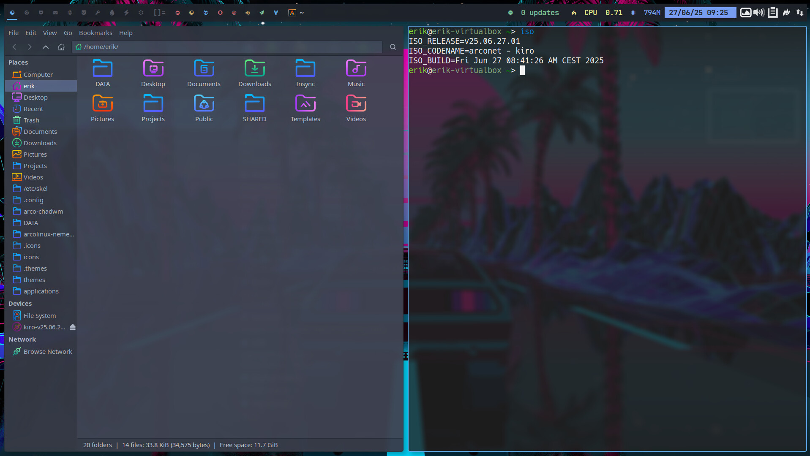

# Kiro Calamares configuration

  

# Download

You can download the latest Kiro ISO from [our SourceForge page](https://sourceforge.net/projects/kiro/files/).

**Kiro** is a customizable Arch Linux ISO builder based on the ArcoLinux project. It provides a simple way to build your own Arch-based installation medium with your choice of packages, settings, and scripts.

Kiro ships with opinionated defaults so it works out of the box:

- systemboot
- ext4
- sddm
- xfce4 and chadwm
- a lot of free software

## 🚀 Features

- Fully customizable build process
- Based on official Arch Linux tools and methodology
- GUI from https://github.com/calamares/calamares
- Script-driven: reproducible and automatable
- Modular structure for easy extension
- Lightweight and minimal by default

## 📦 Requirements

- Arch Linux or Arch-based system (for building) - access to necessary repos (keys - mirrors)
- `archiso` package
- Basic familiarity with Bash scripting and package management
- Knowledge how to build ISOs - https://www.arcolinuxiso.com/a-comprehensive-guide-to-iso-building/
- Playlist of all the KIRO videos - including the creation of BUILDRA based on KIRO

https://www.youtube.com/watch?v=3jdKH6bLgUE&list=PLlloYVGq5pS71UubmlKjjw131PjixMIjW

https://github.com/buildra

# It is super easy to create your own ISO this way

Follow this tuturial and you are already half way there.

https://youtu.be/3jdKH6bLgUE 

Live long and prosper

# Major changes after the videos on youtube

Make sure you read the major change at the bottom of the readme file on 

https://github.com/kirodubes/kiro-iso

<!-- KIRO-FUNDING-FOOTER:START — managed by Kiro-HQ/cascade-readme-footer.sh -->
## Help fund Kiro

Everything I build here stays free and open — always. If Kiro or any of these
tools have ever saved you time or taught you something, a small monthly
contribution helps keep the work going. Donations target break-even, nothing
more — the core always stays free for everyone.

- GitHub Sponsors: https://github.com/sponsors/erikdubois
- Patreon: https://www.patreon.com/c/kiroproject
- YouTube memberships: https://www.youtube.com/@ErikDubois/join
- Ko-fi: https://ko-fi.com/erikdubois
- PayPal: https://www.paypal.me/erikdubois
<!-- KIRO-FUNDING-FOOTER:END -->
